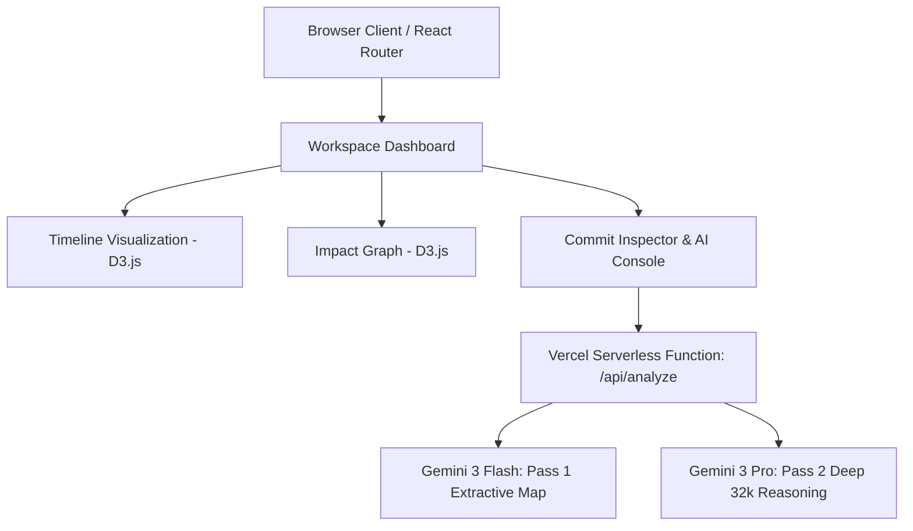

# Git Forensics

> **Enterprise-Grade AI-Powered Time-Travel Debugger & Architectural Audit Console**

Git Forensics is a developer tool that visualizes repository histories, quantifies code volatility, maps structural dependency blast radiuses, and runs multi-pass AI reasoning audits on code deltas. Built with **React 19, TypeScript, D3.js, and Gemini 3**, it translates raw git commits into interactive maps and architectural intelligence.

---

## 🚀 Core Features

### 1. Interactive Timeline & Volatility Heatmap
- **Categorized Commit Visualizer**: Automatically classifies commits using semantic message heuristics into categories: `logic`, `feat`, `fix`, `refactor`, `dependency`, `style`, and `chore`.
- **Volatility Heatmap Overlay**: Computes a rolling neighborhood average of code churn (additions, deletions, and file entropy) to display a continuous risk heatmap using a custom D3.js area curve. Developers can pinpoint risk spikes instantly.
- **Bi-directional Focus**: Clicking any node synchronizes the workspace to load files, diffs, and AI analysis for that commit.

### 2. Multi-Pass AI Forensic Audit Pipeline
- **Pass 1: Logic Delta Extraction**: Uses Gemini 3 Flash to perform a fast, high-density scan of raw patch diffs, mapping state machine changes, API contract revisions, and logic pivots.
- **Pass 2: Deep Reasoning Synthesis**: Feeds the Pass 1 extraction and historical context into Gemini 3 Pro, allocating up to a **32k thinking budget** for deep reasoning. The engine outputs a structured report containing:
  - **Architectural Pivot**: Conceptual intent of the commit.
  - **Regression Risk Profile**: A calibrated 0–100% bug risk score.
  - **Failure Path Simulation**: A step-by-step prediction of what will break first (predictive QA).
  - **Hidden Coupling Scan**: Detections of non-obvious side-effects across decoupled subsystems.
  - **Mitigation Strategies**: Actionable instructions to safely merge and verify the changes.
- **Heuristic Fallback Engine**: If API keys are missing or offline, the tool automatically degrades to local heuristic scanning, mapping volatility using localized code metrics.

### 3. Visual Git Bisect Engine
- **Binary Search Interface**: A visual alternative to standard terminal-based `git bisect` sessions.
- **State Estimation**: Computes the remaining bisect search space, suggests the optimal midpoint commit to test, and estimates the remaining steps using logarithmic calculations ($\lceil \log_2(N) \rceil$).
- **Visual Isolation**: Mark commits as `Good` or `Bad` on the timeline. Safe zones are eliminated, narrowing down the culprit commit.

### 4. Dependency Blast Radius Graph
- **D3.js Force-Directed Layout**: Displays interactive node-link structures representing modified files and their imports.
- **Static Dependency Resolver**: Analyzes commit patches in real-time, scanning for ESM imports, CommonJS requirements, dynamic imports, and paths using alias patterns (`@/*`).
- **Blast Radius Calculation**: Evaluates direct and inferred dependency connections to draw a visual boundary of modified modules and their potential side-effects.

---

## 🛠️ Architecture & Tech Stack



### Frontend
- **Framework**: React 19 (StrictMode)
- **Language**: TypeScript (v5.8)
- **Visualizations**: D3.js v7 (Zooming, panning, force simulations, center/link/collision forces)
- **Styling**: Tailwind CSS (CDN-delivered with custom config, responsive glassmorphic overlay, custom animations)
- **State**: Custom React Hooks (`useGitRepo`, `useGitBisect`) with local storage sync.

### Serverless Backend
- **Endpoint**: Node.js serverless route (`api/analyze.ts`) deployed on Vercel
- **AI SDK**: `@google/genai` (v1.34)
- **Model Orchestration**: Dual-model pipeline targeting `gemini-3-flash-preview` for extractive summarization and `gemini-3-pro-preview` with enabled `thinkingBudget` for deep code reasoning.

---

## 📦 Local Installation & Setup

1. **Clone the Repository**:
   ```bash
   git clone https://github.com/Om-Prakash-Verma/GIT-FORENSICS.git
   cd GIT-FORENSICS
   ```

2. **Configure Environment Variables**:
   Create a `.env` file in the root directory (or configure system env variables):
   ```env
   GEMINI_API_KEY=your_gemini_api_key_here
   ```

3. **Install Dependencies**:
   ```bash
   npm install
   ```

4. **Run Development Server**:
   ```bash
   npm run dev
   ```
   Open `http://localhost:3000` to access the application.

---

## 💼 Resume Showcase: How to Feature This Project

If you built or contributed to this codebase, it represents a strong demonstration of **advanced React engineering, D3.js visualization, and LLM-orchestrated systems**. Below is copy-pasteable material formatted for your CV/Resume and LinkedIn profile.

### Suggested Skills to Add to Your Resume
- **Frontend Development**: React 19, TypeScript, Tailwind CSS, Vite.
- **Data Visualization**: D3.js (Force-directed graphs, zoom/pan behaviors, scale mapping, area heatmaps).
- **Backend & Integrations**: Node.js, Vercel Serverless Functions, REST APIs, Git CLI internals.
- **AI & Systems Engineering**: LLM Pipelines (Dual-pass modeling), Reasoning Budgets, Semantic Classification.

---

### Resume Bullet Points (Copy & Paste)

```markdown
* **Architected and developed "Git Forensics"**, an interactive visual debugging console that reconstructs git timelines, tracks code volatility, and identifies regression paths using a multi-pass LLM pipeline.
* **Designed a force-directed dependency visualization** using D3.js that parses imports (ESM, CommonJS, and module aliases) directly from Git patch diffs to map code "blast radiuses" and flag non-obvious coupling risks.
* **Engineered a Visual Git Bisect Engine** utilizing recursive midpoint binary search logic to mathematically isolate bug culprits, reducing average manual root-cause exploration times.
* **Implemented a dual-pass AI analysis pipeline** integrating extractive models (Gemini Flash) with reasoning models (Gemini Pro) utilizing a 32k thinking budget to generate automated, structured code risk profiles.
* **Built and deployed serverless Node.js endpoints** on Vercel to proxy, sanitize, and orchestrate large-scale patch context analysis, utilizing structured JSON schema constraints to guarantee API responses.
* **Optimized client rendering and state persistence** by crafting lightweight custom React hooks (`useGitRepo`, `useGitBisect`) backed by localStorage recovery strategies, ensuring zero-latency transitions for high-density visual components.
```

---

### Project Description for Portfolios / LinkedIn

**Git Forensics — Developer Tool & Visual Root-Cause Debugger**
* *React 19, TypeScript, D3.js, Node.js, Vercel, Tailwind CSS, Gemini 3 API*

> Designed and built an enterprise-grade developer workspace that visualizes repository histories as interactive timelines. The application maps commits by category, overlays code volatility heatmaps, and features a visual Git Bisect utility for debugging. Using D3.js, the system resolves ESM/CommonJS imports from raw patch diffs to visualize a changed file’s "blast radius" in a force-directed graph. The core auditing engine is powered by a custom dual-pass AI pipeline deployed as a Vercel serverless function: a fast extractive pass maps code changes, and a deep reasoning pass (Gemini 3 Pro with 32k thinking budget) generates structured regression reports, predicting failure paths and identifying hidden coupling between decoupled subsystems.
